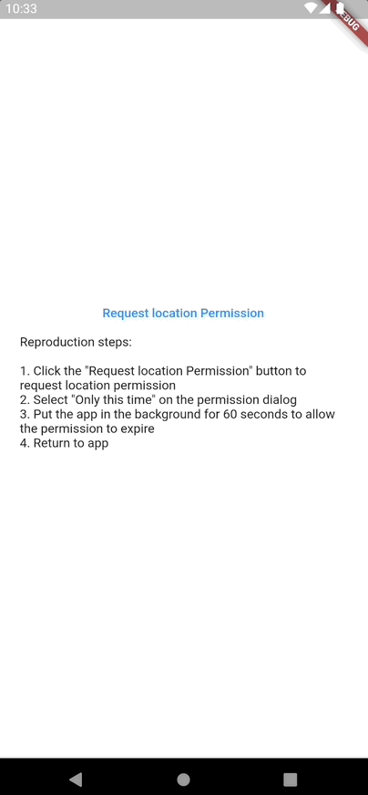
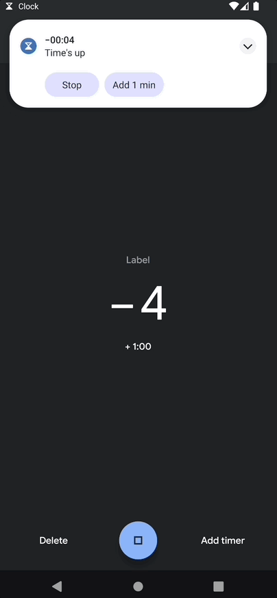

# Flutter Location bug

## Reproduction steps

1. Click the "Request location Permission" button to request location permission
2. Select "Only this time" on the permission dialog
3. Put the app in the background for 60 seconds to allow the permission to expire
4. Return to app

### Request location permission and select "Only this time"

### Return to the app after 60 seconds

Result: stuck on the app splash screen